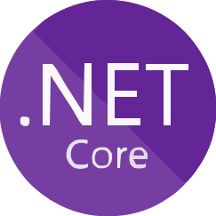
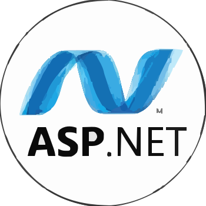
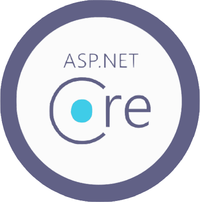

  

## 🌐 Social Media & Developer Platforms  

<table>
  <tr>
    <td>
      

        <h3>🌟 <strong>Hey there</strong> 👋🏻😁 &nbsp;</h3>
        

          Eu sou Anderson, desenvolvedor <strong>full-stack</strong> 💻, com formação superior em <strong>Tecnologia em Informática</strong> 🎓,
          complementada por cursos especializados 📚, além de certificações oficiais Microsoft—<em><strong>MCSA</strong>, <strong>MCSD</strong>, <strong>MCTS</strong>, <strong>MS</strong> e <strong>MCP</strong></em>—🏅
          em áreas essenciais como <strong>programação</strong> 🖥️, <strong>desenvolvimento web</strong> 🌐 e <strong>bancos de dados</strong> 💾.
        

        

          Possuo conhecimento em diversas <strong>linguagens de programação</strong> 💡 e <strong>frameworks</strong> 🛠️,
          atuando no desenvolvimento de <strong>soluções tecnológicas</strong> ✨ aplicadas a diferentes <strong>ambientes</strong> e <strong>requisitos de software</strong> 🌟.
        

        

          Vamos juntos desenvolver <strong>soluções inteligentes</strong> 🤖 que atendam às suas <strong>necessidades</strong> e superem <strong>expectativas</strong>! 😊🚀✨
        

      

      

        

          &nbsp;&nbsp;English Version&nbsp;&nbsp;
          
        

         
        

          <em>I am Anderson, a</em> <strong><em>full-stack developer</em></strong> 💻 <em>with a bachelor's degree in</em> 
          <strong><em>Information Technology</em></strong> 🎓,
          <em>complemented by specialized courses</em> 📚 <em>and official Microsoft certifications—</em>
          <strong><em>MCSA</em>, <em>MCSD</em>, <em>MCTS</em>, <em>MS</em>, <em>MCP</em></strong>—🏅
          <em>in key areas such as</em> <strong><em>programming</em></strong> 🖥️, <strong><em>web development</em></strong> 🌐, 
          <em>and</em> <strong><em>databases</em></strong> 💾.
        

        

          <em>I have expertise in various</em> <strong><em>programming languages</em></strong> 💡 <em>and</em> 
          <strong><em>frameworks</em></strong> 🛠️,
          <em>working on the development of</em> <strong><em>technological solutions</em></strong> ✨ 
          <em>tailored to different</em> <strong><em>environments</em></strong> <em>and</em> 
          <strong><em>software requirements</em></strong> 🌟.
        

        

          <em>Let's work together to develop</em> <strong><em>smart solutions</em></strong> 🤖 
          <em>that meet your</em> <strong><em>needs</em></strong> <em>and exceed your</em> 
          <strong><em>expectations</em></strong>! 😊🚀✨
        

      

    </td>
  </tr>
  <tr>
    <td>
       
      

        
        
        
        
      

      

        

          
<h3>More Certs ➕</h3>

          

            
            
            
            
          

        

        
<em>Trademark policy: <a href="https://download.microsoft.com/download/5/4/f/54f69536-6b19-4817-ab48-ab2c6856eae5/mcp_logo_guidelines_june_2013.pdf">mcp_logo_guidelines_june_2013.pdf</a></em>

      

    </td>
  </tr>
</table>

<h1>✨ Certifications 🥇📜</h1>

 

<h1>✨ Skills & GitHub Analytics 🧠⚙️📊📈</h1>

<table>
       <tr>
          <td>
            <table> 
        <tr>
            <td colspan="5"><h3>💡 Core Skills</h3></td>
        </tr>
        <tr>
            <td></td>
            <td></td>
            <td></td>
            <td></td>
            <td></td>
        </tr>
        <tr>
            <td></td>
            <td></td>
            <td></td>
            <td></td>
            <td></td>
        </tr>
        <tr>
            <td></td>
            <td></td>
            <td></td>
            <td></td>
            <td></td>
        </tr>
        <tr>
            <td></td>
            <td></td>
            <td></td>
            <td></td>
            <td></td>
        </tr>
        <tr>
            <td></td>
            <td></td>
            <td></td>
            <td></td>
            <td></td>
        </tr>
        <tr>
            <td></td>
            <td></td>
            <td></td>
            <td></td>
            <td></td>
        </tr>
        <tr>
            <td></td>
            <td></td>
            <td></td>
            <td></td>
            <td></td>
        </tr>
        <tr>
            <td></td>
            <td></td>
            <td></td>
            <td></td>
            <td></td>
        </tr>
        <tr>
            <td></td>
            <td></td>
            <td></td>
            <td></td>
            <td></td>
        </tr>
        <tr>
            <td></td>
            <td></td>
            <td></td>
            <td></td>
            <td></td>
        </tr>
        <tr>
            <td></td>
            <td></td>
            <td></td>
            <td></td>
        </tr>
        </table> 
         
        <table>
        <tr>
            <td colspan="5"><h3>➕ More Skills</h3></td>
        </tr>
      	<tr>
      		<td></td>
      		<td></td>
      		<td></td>
      		<td></td>
          <td></td>
      	</tr>
      	<tr>
      		<td></td>
      		<td></td>
      		<td></td>
          <td></td>
      		<td></td>
      	</tr>
      	<tr>
      		<td></td>
      		<td></td>
          <td colspan="3"></td>
        </tr>
      	<tr>
      		<td colspan="5">               </td>
      	</tr>
      </table>
        </td>
        <td>
          

            <h3>✨ Github Readme Stats 📊💻</h3>
          

          

            <!-- Estatísticas principais -->
            
            
            <!-- Contribuições -->
            
            <!-- Detalhes do perfil -->
            
            <!-- Estatísticas avançadas -->
            
            <!-- Gráfico de atividades -->
            
          

          

            <h3>✨ Trophies 🏆🎖️</h3>
          

          

            
            
          

        </td>
       </tr>
  </table>
  

     <em>All trademarks mentioned are the property of their respective owners.</em>
  

 

<h1>✨ Pinned Repositories 📌📂</h1>

  

